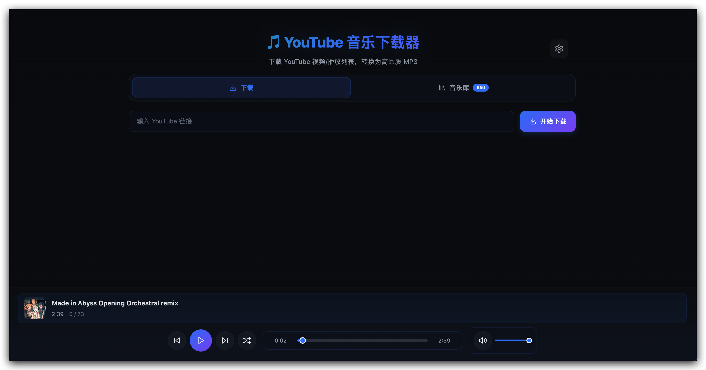
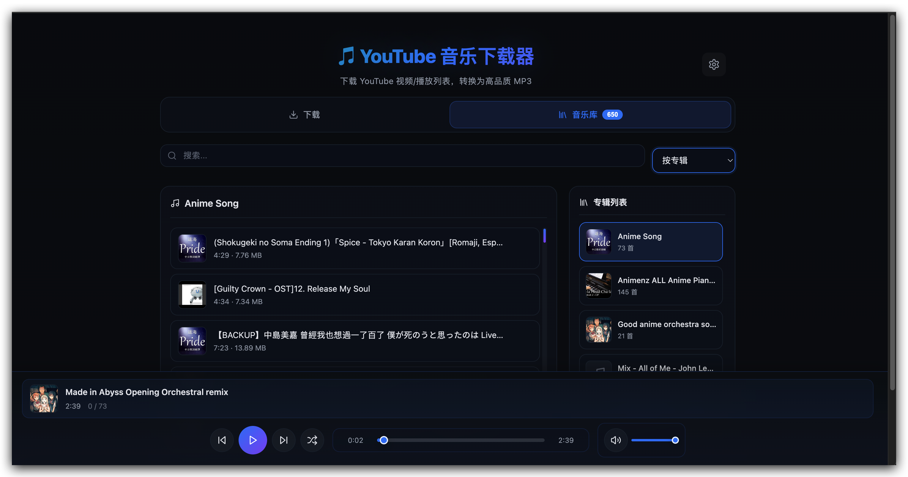
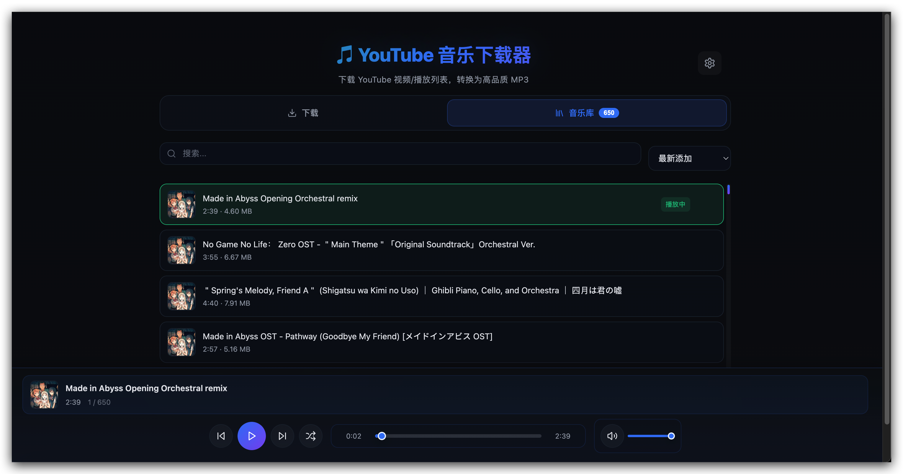
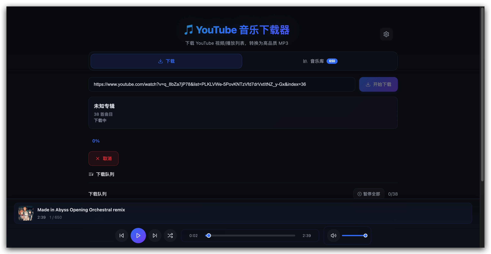
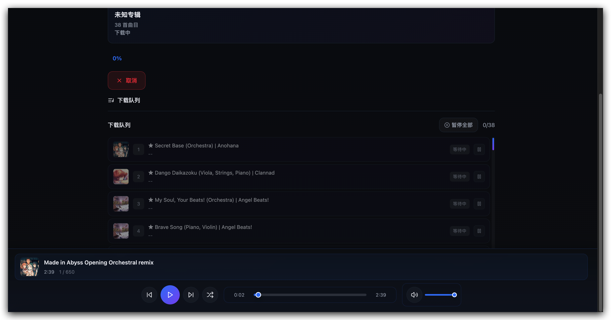
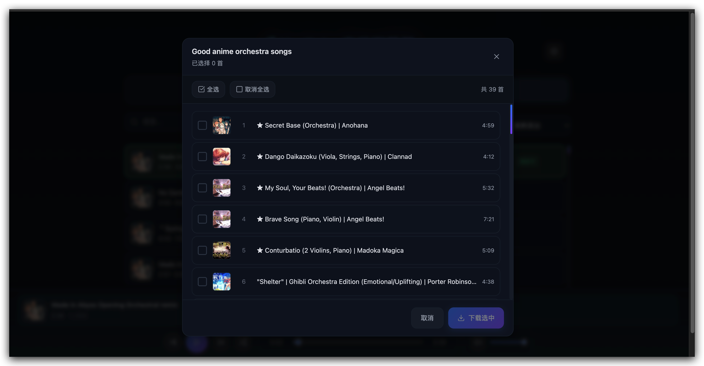

# 🎵 YouTube 音乐下载器

一个本地运行的 YouTube 音乐下载工具，支持播放列表/专辑下载，转换为高品质 MP3，内置音乐播放器。

## 📸 截图预览

| 主界面 | 音乐库 - 专辑模式 |
|:---:|:---:|
|  |  |

| 音乐库 - 列表模式 | 下载页面 |
|:---:|:---:|
|  |  |

| 下载队列 | 选择曲目下载 |
|:---:|:---:|
|  |  |

## ✨ 功能特性

### 下载功能
- 📥 **播放列表批量下载** - 支持整个播放列表/专辑批量下载
- ✅ **选择性下载** - 可选择播放列表中的特定曲目下载
- 🎨 **自动获取封面** - 自动获取每首歌的封面图
- 📊 **实时进度追踪** - 显示下载进度和当前曲目
- ⏸️ **暂停/继续** - 支持暂停和继续下载任务
- 📦 **ZIP 打包** - 下载完成后自动打包为 ZIP

### 播放功能
- 🎵 **内置播放器** - 无需下载即可在线播放
- 🔀 **随机播放** - 支持顺序/随机播放模式
- ⌨️ **快捷键控制** - 空格键暂停/播放
- 💾 **播放状态保存** - 刷新页面后恢复播放进度
- 🎼 **专辑模式** - 按专辑分组浏览和播放

### 管理功能
- 📚 **音乐库管理** - 统一管理所有已下载的音乐
- 🔍 **搜索功能** - 快速搜索曲目
- 🗂️ **多种排序** - 支持按时间、字母、专辑排序
- 🗑️ **删除功能** - 支持删除单曲或整个任务

## 🚀 快速开始

### 环境要求
- Python 3.10+
- macOS（项目内置 `yt-dlp_macos`）
- `ffmpeg`（用于音频转换）
- Node.js 18+（用于前端构建）

### 1. 安装依赖

```bash
# 安装 ffmpeg（macOS）
brew install ffmpeg

# 初始化项目
make init
```

### 2. 启动服务

```bash
make run
```

默认访问地址：http://127.0.0.1:5001

### 3. Raycast 快捷启动（可选）

复制 `raycast-launch.sh` 到 Raycast 脚本目录，搜索 "YouTube 下载器" 即可一键启动。

## 🧭 使用说明

### 下载音乐
1. 在下载页面粘贴 YouTube 链接（支持单个视频、播放列表、频道链接）
2. 选择要下载的曲目（播放列表模式）
3. 点击开始下载，支持暂停/继续/取消
4. 下载完成后自动添加到音乐库

### 播放音乐
- 播放控制：播放/暂停、上一首/下一首、随机播放
- 快捷键：空格键暂停/播放
- 进度条：拖动跳转

### 音乐库管理
- 搜索：在搜索框输入关键词
- 排序：最新/最早添加、A-Z/Z-A、按专辑分组
- 专辑模式：按专辑浏览，点击专辑查看曲目

## 🧩 常见问题

| 问题 | 解决方案 |
|------|----------|
| 缺少 ffmpeg | `brew install ffmpeg` |
| yt-dlp 权限错误 | `chmod +x ./yt-dlp_macos` |
| 端口被占用 | `PORT=8080 make run` |
| 封面不正确 | `.venv/bin/python fix_covers.py` |

## 📝 开发说明

```bash
cd web && npm run dev    # 前端开发
cd web && npm run build  # 构建前端
make bundle              # 打包桌面应用（Tauri）
```

## �️ 高级功能

### 修复已下载文件的封面

如果之前下载的文件封面不正确，可以运行修复脚本：

```bash
.venv/bin/python fix_covers.py
```

脚本会扫描所有已下载的音乐，通过 YouTube 搜索获取正确的封面并更新。

### 修改端口

```bash
PORT=8080 make run
```

### 设置下载目录

在应用右上角点击设置按钮，可以自定义下载目录和迁移已有文件。

## 📁 项目结构

```
├── app.py              # Flask 主应用
├── config.py           # 配置文件
├── models.py           # 数据模型
├── job_manager.py      # 下载任务管理
├── ytdlp_service.py    # yt-dlp 封装
├── tracks_service.py   # 曲目文件服务
├── settings_service.py # 用户设置服务
├── fix_covers.py       # 封面修复脚本
├── web/                # 前端源码（React + TypeScript）
│   ├── src/
│   │   ├── components/ # React 组件
│   │   ├── hooks/      # 自定义 Hooks
│   │   └── api.ts      # API 调用
├── static/             # 前端构建产物
├── download/           # 下载的 MP3 文件（默认）
├── jobs/               # 任务临时文件
└── yt-dlp_macos        # yt-dlp 可执行文件
```

## �🔧 技术栈

- **后端**: Python + Flask
- **前端**: React + TypeScript + Vite
- **UI**: Lucide Icons
- **下载**: yt-dlp
- **音频**: ffmpeg + mutagen
- **桌面应用**: Tauri (可选)

## 🧩 更多问题解答

### 下载速度慢？

- 检查网络连接
- YouTube 可能限速，属于正常现象
- 可以尝试使用代理

### 如何更新 yt-dlp？

```bash
# 下载最新版本
curl -L https://github.com/yt-dlp/yt-dlp/releases/latest/download/yt-dlp_macos -o yt-dlp_macos
chmod +x yt-dlp_macos
```

### 支持哪些链接格式？

- 单个视频: `https://www.youtube.com/watch?v=xxx`
- 播放列表: `https://www.youtube.com/playlist?list=xxx`
- 频道: `https://www.youtube.com/@channel` (会列出所有播放列表供选择)

## ⚠️ 注意事项

- 本工具仅供个人学习使用
- 请遵守相关法律法规和平台服务条款
- 下载的内容请勿用于商业用途
- 需要安装 ffmpeg 才能转换音频格式

## 📄 许可证

MIT License
